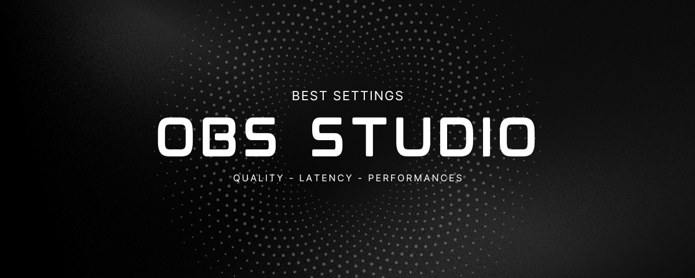

# 🇬🇧 English
**Please leave a ⭐ to this repository !**

All theses settings are a base and probably need to be customized to your needs.

## Local Recording Configuration
Use this profile to create high-quality source files, perfect for video editing.

| Section | OBS Parameter | Recommended Setting | Reason |
| :--- | :--- | :--- | :--- |
| **Output (Recording)** | Video Encoder | **NVIDIA NVENC HEVC** | Best efficiency (quality/file size) and supports 10-bit color (`main10`). |
| | Rate Control | **CQP** (Constant Quantization Parameter) | **Guarantees constant quality** by adjusting the bitrate: **no quality loss** and **no artifacts**. |
| | CQ Level | **14-20 (16 recommended)** | Ideal value for visually **lossless** quality. |
| | Recording Format | **MKV** | Safety: protects the file from corruption in case of OBS or system crash. |
| | Preset | **P6: Slow (Best Quality)** | Try P5-P4 if your lagging |
| | Profile | **main10** | For a richer color palette (10-bit) and to prevent banding. |
| **Video** | Base (Canvas) Resolution | **2560x1440** | Native resolution of your monitor. |
| | Output (Scaled) Resolution | **1920x1080-2560x1440** | Records the raw resolution (no scaling). |
| | FPS | **60** | Maximum fluidity. |
| **Advanced** | Color Range | **Full 709.** | For deep blacks and bright whites. |
| | Process Priority | **Normal** | Don't change it!. |

---

## YouTube Streaming Configuration
Use this profile for a stable, fluid, and high-quality live stream, optimized for the platform and your fiber connection.

| Section | OBS Parameter | Recommended Setting | Reason |
| :--- | :--- | :--- | :--- |
| **Output (Streaming)** | Video Encoder | **NVIDIA NVENC H.264** | Required standard for YouTube streaming. |
| | Rate Control | **CBR** (Constant Bitrate) | **Mandatory for a stable stream** without buffering for the viewer. |
| | Bitrate | **12,000 Kbps** | Very high bitrate (change to your connection) for flawless 1080p60 quality, reducing artifacts. |
| | Preset | **P6: Slow (Best Quality)** | Maximizes the quality of the H.264 encoding. |
| | Max B-frames | **2** | Better streaming compatibility and performance. |
| **Video** | Base (Canvas) Resolution | **1920x1080-2560x1440** | Native resolution of your monitor. |
| | Output (Scaled) Resolution | **1920x1080** | Final stream resolution (1080p). |
| | Downscale Filter | **Lanczos (36 Samples)** | Best algorithm for sharp scaling down from 1440p to 1080p. |
| | FPS | **60** | Maximum stream fluidity. |

---

# 🇫🇷 Français
**Ajoute une ⭐ pour ce repository !**

Tous ces paramètres servent de bases et tu va surement devoir les modifiers pour tes besoins.

## Configuration d'Enregistrement Local
Utilisez ce profil pour créer des fichiers sources de haute qualité, parfaits pour le montage vidéo.

| Section | Paramètre OBS | Réglage Recommandé | Raison |
| :--- | :--- | :--- | :--- |
| **Sortie (Enregistrement)** | Encodeur Vidéo | **NVIDIA NVENC HEVC** | Meilleure efficacité (qualité/taille de fichier) et support de la couleur 10-bit (`main10`). |
| | Contrôle du débit | **CQP** (Constant Quantization Parameter) | **Garantit une qualité constante** en ajustant le débit : **aucune perte de qualité** et **aucun artefact**. |
| | Niveau de CQ | **14-20 (16 recommandé)** | Valeur idéale pour une qualité visuellement **sans perte**. |
| | Format d'enregistrement | **MKV** | Sécurité : protège le fichier contre la corruption en cas de plantage d'OBS ou du système. |
| | Pré-réglage | **P6 : Plus lent (Meilleure qualité)** | Essayez P5-P4 en cas de ralentissements. |
| | Profile | **main10** | Pour une palette de couleurs plus riche (10 bits) et prévenir l'effet de banding. |
| **Vidéo** | Résolution de Base (Canevas) | **2560x1440** | Résolution native de votre moniteur. |
| | Résolution de Sortie (Mise à l'échelle) | **1920x1080 - 2560x1440** | Enregistre la résolution brute (pas de mise à l'échelle). |
| | IPS | **60** | Fluidité maximale. |
| **Avancé** | Gamme de Couleurs | **Complète 709.** | Pour des noirs profonds et des blancs lumineux. |
| | Priorité du Processus | **Normale** | Ne pas modifier ! |

---

## Configuration de Streaming YouTube

Utilisez ce profil pour un direct stable, fluide et de haute qualité, optimisé pour la plateforme et votre connexion fibre.

| Section | Paramètre OBS | Réglage Recommandé | Raison |
| :--- | :--- | :--- | :--- |
| **Sortie (Streaming)** | Encodeur Vidéo | **NVIDIA NVENC H.264** | Standard requis pour le streaming sur YouTube. |
| | Contrôle du débit | **CBR** (Constant Bitrate) | **Obligatoire pour un flux stable** sans coupures ni mise en mémoire tampon chez le spectateur. |
| | Débit | **12 000 Kbps** | Débit très élevé (à ajuster selon votre connexion) pour une qualité 1080p60 impeccable, réduisant les artefacts. |
| | Pré-réglage | **P6 : Plus lent (Meilleure qualité)** | Maximise la qualité de l'encodage H.264. |
| | Max B-frames | **2** | Meilleure compatibilité et performance de streaming. |
| **Vidéo** | Résolution de Base (Canevas) | **1920x1080 - 2560x1440** | Résolution native de votre moniteur. |
| | Résolution de Sortie (Mise à l'échelle) | **1920x1080** | Résolution finale du stream (1080p). |
| | Filtre de Mise à l'échelle | **Lanczos (36 échantillons)** | Meilleur algorithme pour une réduction de 1440p à 1080p avec netteté. |
| | IPS | **60** | Fluidité maximale du stream. |

---
